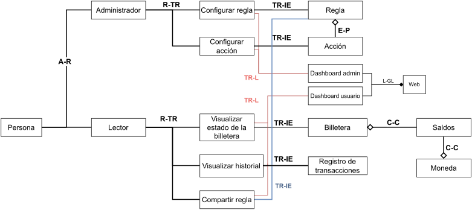
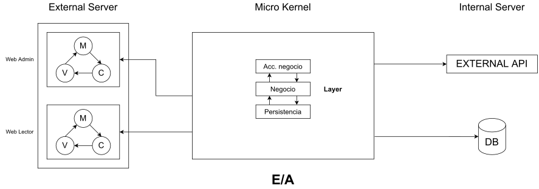

## Modelo de Dominio

## Arquitectura

- Las funcionalidades de visualizacion, monitoreo y definicion de reglas requieren una buena **usabilidad**. Una arquitectura **MVC** puede aportar.

- La naturaleza del servicio requiere que se tenga fuertemente en cuenta la **seguridad**.

- Hay diferentes **roles** que interactuan de manera diferente con un mismo conjunto de recursos, se puede aplicar una arquitectura de **microkernel** para resolverlo.

- Se diferencia un **cliente** de un **servicio externo**, aplica la arquitectura **EA**.

- Como hay diferentes **niveles de abstracción** dentro del microkernel, se puede utilizar un patrón **Layer**.

- La **capa** de acceso al negocio aporta a la **seguridad** del sistema.

|              | Usabilidad | Evolucion | Performance Escalabilidad | Disponibilidad Resiliencia | Seguridad |
| ------------ | :--------: | :-------: | :-----------------------: | :------------------------: | :-------: |
| Funcional    |     X      |     X     |             x             |                            |     x     |
| Informacion  |            |     X     |             x             |                            |     x     |
| Desarrollo   |     X      |     X     |                           |                            |     x     |
| Concurrencia |            |     x     |             X             |             x              |           |
| Despliegue   |            |           |             X             |             X              |     X     |
| Operacional  |     X      |           |                           |             x              |     x     |
